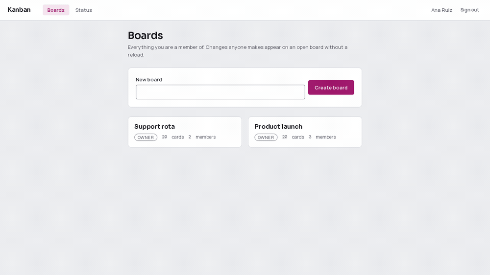

# Kanban: a board that two people can drag at the same time

[](https://github.com/bastian-red/kanban-realtime/actions/workflows/ci.yml)

Boards, lists and cards with drag and drop, live sync across every open browser,
presence, per-board roles and a permanent activity history. Next.js 14, NestJS 10 and a
Socket.io gateway over PostgreSQL 16 and Redis 7, in a pnpm/Turborepo monorepo.

The interesting part is not the CRUD. It is that **every way two people using one board at
once could corrupt it is closed by a mechanism that cannot be forgotten**: card order is a
fractional index with a `UNIQUE` constraint behind it, a concurrent edit is refused by a
version column rather than silently overwriting, and a broadcast reaches a colleague on a
different gateway replica because Redis pub/sub carries it. Each of those is a database
constraint or a separate process, not a code-review habit, and each has a test that goes
red when you take it away.



## The five properties, and the test that proves each

| #   | Property                                                | Where it lives                                              | What proves it                                                                                                                                       |
| --- | ------------------------------------------------------- | ----------------------------------------------------------- | ---------------------------------------------------------------------------------------------------------------------------------------------------- |
| 1   | Twenty simultaneous drops into one gap all land         | `UNIQUE (list_id, position)` + `services/ordering`'s jitter | fires 20 concurrent moves between the same two cards; all 20 succeed, all 20 positions are distinct, and the column's order is total                 |
| 2   | A move on one gateway reaches a client on another       | `@socket.io/redis-adapter`, two replicas on 4100 and 4101   | a client on `:4100` moves a card and a client on `:4101` receives `card.moved`; deleting the adapter turns 7 tests red and leaves the other 12 green |
| 3   | Two edits of one card never lose one silently           | `version` column + `UPDATE ... WHERE version = $expected`   | two simultaneous `PATCH`es with the same expected version: exactly one 200, one 409, and the version moves by 1 rather than 2                        |
| 4   | The roster forgets somebody who stopped heartbeating    | a per-field timestamp in a Redis hash, swept on read        | a stale entry is written straight into Redis and is gone from the next roster, and from the hash                                                     |
| 5   | Every state is legible with no colour perception at all | words from `wipStateFor`, `presenceLabel`, `dueLabel`       | the page is rendered in forced greyscale and each state is still identifiable from its text                                                          |

## The ordering problem, and why `position` is a string

Two people drop a card into the same gap at the same moment. With an integer `position`,
both clients renumber every card below the gap, and the second write undoes the first.

So `position` is a base62 **fractional index** (`services/ordering`): inserting between `a0`
and `a1` produces something like `a0V`, and touches exactly one row. The keys are
**jittered**, so two clients naming the same two neighbours usually get different keys and
both land.

Usually is not always, which is where the database comes in:

```sql
-- packages/db/prisma/migrations/20260807120000_init/migration.sql
CREATE UNIQUE INDEX "cards_list_id_position_key" ON "cards"("list_id", "position");
```

It comes from a `@@unique([listId, position])` in the schema rather than from the
`board_invariants` migration beside it — that one carries the things Prisma cannot express,
like the `CHECK` on the position's format and the partial unique index that allows exactly
one `OWNER` per board.

That constraint is what makes a collision **observable**. Without it both writes succeed,
two cards share a position, and the column's order becomes whatever the query planner
returned — wrong everywhere and an error nowhere. With it, the second write is refused,
`moveCard` re-jitters and retries up to `MOVE_RETRY_ATTEMPTS`, and the integration lane
asserts that twenty simultaneous movers all end up somewhere distinct.

The measurement that shaped the design is in `services/board-store/src/index.ts`: removing
the row lock entirely and firing 50 simultaneous moves into one gap still produced 50
successes and zero retries, because `fractional-indexing-jittered` picks from ~47,665
values and the expected number of collisions among 50 writers is about 0.026. The jitter is
doing the work; the lock is kept for the `reconciled` flag, which needs a stable read.

The optimistic lock is a **different** mechanism for a different failure. Fractional
indexing has nothing to say about two people editing the same card's title: they are
competing for one row, not for a gap between rows. That is what `version` is for, and
without it the second write wins with no error, no conflict marker and nothing in the
activity feed — the first person's browser still shows what they typed, because their own
optimistic update succeeded.

## Why there are two gateway processes in the test suite

`apps/realtime` is the process that scales horizontally. Several replicas serve one board,
and `@socket.io/redis-adapter` is what makes them one logical server.

This is very easy to test wrongly. With a single gateway, every socket shares one in-memory
adapter and a broadcast arrives whether or not the Redis adapter is wired at all — the
assertion passes with the mechanism deleted. So `scripts/integration.sh` starts
`apps/realtime/dist/main.js` **twice**, on 4100 and 4101, and the suite puts one client on
each. The only path between them is Redis.

Commenting out one line proves it discriminates:

```
io.adapter(createAdapter(pub, sub));   // removed
→ 7 failed, 12 passed
   ✘ delivers a move made on :4100 to a client on :4101
   ✘ delivers a REST write to every socket, through the Redis emitter
   ✘ tells a client on :4100 that somebody joined on :4101
   ✓ twenty simultaneous moves into one gap        (does not need the adapter)
   ✓ the per-card optimistic lock                  (does not need the adapter)
```

The REST API runs no Socket.io server at all. A board rename happens on the boards list
where nobody has a socket open, and it still has to reach everybody who does —
`@socket.io/redis-emitter` publishes onto the same channel the adapter subscribes to.

## The gateway's `/health` is not a liveness probe

A gateway whose pub/sub is dead still works, locally. Sockets stay connected, drags still
land in Postgres, and the two people on _that_ replica still see each other. What stops is
delivery to every other replica — silently, because publishing to Redis is fire-and-forget
and there is nothing to fail.

So `/health` **round-trips a nonce through the adapter's own two Redis connections** and
returns 503 if it does not come back. Pinging Redis proves only that a third connection can
reach the server.

```json
{
  "status": "ok",
  "version": "0.1.0",
  "uptimeSeconds": 42,
  "checks": [
    { "name": "postgres", "status": "ok", "latencyMs": 2, "detail": null },
    { "name": "redis", "status": "ok", "latencyMs": 1, "detail": null },
    { "name": "adapter", "status": "ok", "latencyMs": 3, "detail": null }
  ],
  "connectedSockets": 3,
  "rooms": 2
}
```

`/status` renders both services' reports side by side, and probes **both** gateway replicas
when a second one is configured: one replica green and one red is this product's worst
symptom — half the people on a board see each other and half do not — and it is invisible
to a page that only asks whichever replica it happens to reach.

## Colour is never the only channel, and that is measured

The three WIP inks separate by **1.23:1 in greyscale in light and 1.02:1 in dark**. That is
not an estimate; `apps/web/lib/contrast.test.ts` computes it from the real stylesheet. To a
deuteranopic reader they are the same colour.

So every state ships a word: `wipStateFor` produces `At limit 3/3`, `presenceLabel` produces
`Ana Ruiz, moving a card`, `dueLabel` produces `Overdue by 3 days`, and the drop target says
`Drop here`. `e2e/tests/state-legibility.spec.ts` renders the whole board in forced
greyscale and asserts each one is still identifiable.

The rest of the design gates are deterministic and run on every commit:
`identity.test.ts` pins the palette and the three typefaces, `contrast.test.ts` checks every
pair against WCAG AA in both schemes, `tokens.test.ts` catches a `var()` that resolves to
nothing, and `classnames.test.ts` fails when a component uses a class the stylesheet does
not declare.

`e2e/tests/a11y.spec.ts` runs axe over every route in both colour schemes, in Chromium and
Firefox, and requires zero violations. Both engines, because Firefox's run is what reported
three scrollable regions on this board as keyboard-inaccessible (WCAG 2.1.1) and Chromium's
did not.

Axe cannot check the one that matters most here, though. Dragging a card is the app's primary
interaction and it is fully keyboard-operable, which is where an automated audit stops — but
`@dnd-kit`'s default announcements read `active.id` aloud, and every id on this board is a
cuid. Operable and unusable is the worse of the two failures, because it passes the audit.
`apps/web/lib/drag-announcements.ts` builds the sentences from the board instead
(`Dropped Write the release notes into In progress, 2 of 2.`), as pure functions with 13 gate
tests. Being real text rather than a timing artefact, it is also what the E2E drag waits on:
`keyboardMove` presses a key and blocks until the live region says something new, which
replaced a 150ms sleep that failed 3 runs in 45 on a single core.

## Architecture

```
                    ┌──────────────┐
   browser ────────▶│  apps/web    │  Next.js 14, Auth.js session
      │             │  :3000       │  mints a short-lived HS256 service token
      │             └──────┬───────┘
      │ WebSocket          │ HTTP + Bearer
      ▼                    ▼
┌──────────────┐    ┌──────────────┐
│apps/realtime │    │  apps/api    │  NestJS 10, holds no session
│  :4100 :4101 │    │  :4000       │
└──────┬───────┘    └──────┬───────┘
       │                   │
       │  both call        ▼
       └──────────▶ services/board-ops ──▶ services/board-store ──▶ PostgreSQL
                    (the write path)        (Prisma adapter)
       │
       └──────────▶ Redis ─── pub/sub adapter (replica ↔ replica)
                         └── presence roster
```

One `moveCard`, two transports. A drag that arrives over a socket and a drag that arrives
over HTTP execute the same function, against the same repository, taking the same row lock
and enforcing the same permission matrix. The gateway does not forward to the API — that
would double the latency of the one interaction the product is judged on, and give the two
transports two chances to disagree about a write.

| Package                | What it owns                                                              |
| ---------------------- | ------------------------------------------------------------------------- |
| `apps/web`             | Next.js app, the board UI, the socket client, the design system           |
| `apps/api`             | REST surface, auth, activity feed, the Redis emitter for REST broadcasts  |
| `apps/realtime`        | Socket.io gateway; horizontally scalable, verifies the same token         |
| `services/board-ops`   | the write path: permissions, ordering, retries. No database, no framework |
| `services/board-store` | the Prisma adapter for that write path, plus the board read               |
| `services/ordering`    | base62 fractional indices, jittered                                       |
| `services/presence`    | the Redis roster: socket-keyed, collapsed to people on read               |
| `packages/shared`      | contracts, the socket protocol, the permission matrix, time helpers       |
| `packages/db`          | Prisma schema, migrations, seed                                           |

## Running it

Needs Node 20, pnpm 9 and Docker.

```bash
git clone https://github.com/bastian-red/kanban-realtime.git
cd kanban-realtime
pnpm install

cp .env.example .env
sed -i "s|^AUTH_SECRET=|AUTH_SECRET=$(openssl rand -base64 32)|" .env

docker compose -f infra/docker-compose.yml up -d      # Postgres 5437, Redis 6384
pnpm db:generate && pnpm db:deploy && pnpm db:seed
pnpm dev
```

Then open <http://localhost:3000> and sign in as `ana@kanban.local` / `kanban-demo-2026`.
Open the same board in a second browser to watch a drag cross.

The seed plants four people with four different roles, because the permission matrix is a
feature and one user cannot demonstrate it: Ana owns both boards, Bruno edits, Carla views
(sign in as her to see the drag handles disappear), and Dan is on the second board only.

**`pnpm dev` points at `scripts/dev.sh`, not at `turbo run dev`, and that is load-bearing.**
Turbo does not read `.env`, and Turborepo 2 runs in strict environment mode: only names
declared in `turbo.json` reach a task's child process, and everything else is stripped
silently. Three sibling projects in this portfolio shipped with a short list there, which
meant `pnpm dev` started an API with no `AUTH_SECRET` and every server render died with
`ECONNREFUSED`. `scripts/env-contract.mjs` now fails the build if the source, `.env.example`
and `turbo.json` disagree in any of four directions, and `scripts/dev-smoke.sh` boots the
real `pnpm dev` with every `.env` name stripped from its environment and asserts a board
arrives over a socket.

To run the whole stack from images instead, including a second gateway replica:

```bash
docker compose -f infra/docker-compose.yml --profile app up -d --build
```

## Testing

Five lanes, different budgets.

```bash
pnpm test                  # gate lane: 686 unit tests, no network, no database
pnpm env:contract          # the environment contract, free and instant
pnpm scan:invisible        # a character you cannot see is a bug you cannot review
./scripts/dev-smoke.sh     # boots the documented `pnpm dev` and asserts a live board
./scripts/integration.sh   # real Postgres, real Redis, TWO gateway processes
./scripts/e2e.sh           # Playwright: Chromium + Firefox, 90 specs including axe
```

| Lane        | Count | What only it can prove                                                |
| ----------- | ----- | --------------------------------------------------------------------- |
| Unit        | 686   | ordering arithmetic, the permission matrix, the board reducer         |
| Environment | 1     | every name the code reads is declared and documented                  |
| Dev smoke   | 1     | the README's own command produces a working, live app                 |
| Integration | 19    | concurrency, the optimistic lock, cross-replica delivery, TTLs        |
| E2E         | 90    | the flows a person performs, in two engines, with zero axe violations |

Three things this suite does deliberately:

- **The E2E specs create their own boards.** They run serially against one database with no
  reseed between files, so a spec that dragged a seeded card would leave every later spec —
  and the _next browser project_ — asserting about a card that has moved.
- **Assertions are on content, never on a status code.** A broken app answers 200 with an
  error page, which is exactly what a missing `AUTH_SECRET` produces.
- **Every proof has been shown to fail.** The adapter, the unique index, `dev.sh`, the
  gateway's cold-start build and the drag fixture's synchronisation were each reverted and the
  corresponding lane watched go red before being restored. Reverting the gateway's `dev` script
  to `tsc --watch & node --watch dist/main.js` makes `dev-smoke.sh` report
  `realtime (:4100) never came up`; putting the drag fixture's `waitForTimeout` back and running
  `taskset -c 0 ./scripts/e2e.sh --repeat-each=3` fails 3 of 45.

## Configuration

Every name is documented in `.env.example` and declared in `turbo.json`; the contract check
fails if those two and the source ever disagree. The ones worth knowing:

| Variable                     | Default | Why it is a knob                                                                                                                                           |
| ---------------------------- | ------- | ---------------------------------------------------------------------------------------------------------------------------------------------------------- |
| `MOVE_RETRY_ATTEMPTS`        | 5       | how many times a move re-jitters after a position collision                                                                                                |
| `PRESENCE_HEARTBEAT_SECONDS` | 10      | how often a client refreshes its roster entry                                                                                                              |
| `PRESENCE_TTL_SECONDS`       | 25      | must be **more than twice** the heartbeat, or one dropped packet evicts somebody who is still looking at the board. The gateway refuses to start otherwise |
| `SOCKET_EVENT_RATE_LIMIT`    | 240     | events per minute per socket, in process memory rather than Redis: a socket lives on exactly one replica for its whole life                                |
| `REALTIME_BASE_URL_2`        | —       | a second gateway replica, for `/status` to probe and for the integration lane to broadcast across                                                          |

## Not deployed, on purpose

This is one of thirteen portfolio projects, all published to GitHub and hosted nowhere. Free
tiers do not stretch to thirteen deploys and paying for them buys nothing that this
repository does not already show. What survives instead is the evidence that the thing is
operable: a real `/health` on both services that checks its dependencies rather than its own
pulse, a `/status` page fed by the same endpoints, a Dockerfile per service, a compose file
that brings the whole stack up including a second replica, and CI that runs every lane above
on every push.
